# Workflow Dependency Map
Generated: 2026-05-30 09:41

## Diagram

```mermaid
graph TD
  2U7mxHMyqA41ROKX["WF-47 Unsubscribe Handler"] --> BUVun38WEKb12zg9["WF-50 Send WhatsApp"]
  2U7mxHMyqA41ROKX["WF-47 Unsubscribe Handler"] --> wlZRK0YxnhP0b2RL["WF-51 Send Slack Message"]
  3va0M06kijgyLejf["WF-43 Post-Consultation Handler"] --> eTV1lUcYrXBg2q2T["WF-25 Intent Classifier"]
  3va0M06kijgyLejf["WF-43 Post-Consultation Handler"] --> MUG7rPgSHc7UtAE9["WF-45 Rebook Handler"]
  3va0M06kijgyLejf["WF-43 Post-Consultation Handler"] --> Du2CJ3OTohRFZYoA["WF-44 Feedback Recorder"]
  3va0M06kijgyLejf["WF-43 Post-Consultation Handler"] --> BUVun38WEKb12zg9["WF-50 Send WhatsApp"]
  3va0M06kijgyLejf["WF-43 Post-Consultation Handler"] --> 2U7mxHMyqA41ROKX["WF-47 Unsubscribe Handler"]
  3va0M06kijgyLejf["WF-43 Post-Consultation Handler"] --> wlZRK0YxnhP0b2RL["WF-51 Send Slack Message"]
  6PzJRZsF7k2d9hV7["WF-41 Admin -> User Relay"] --> BUVun38WEKb12zg9["WF-50 Send WhatsApp"]
  9Zt23yt8k8PQSgji["WF-61 U2 Silent-Drop & Escalate"] --> wlZRK0YxnhP0b2RL["WF-51 Send Slack Message"]
  BUVun38WEKb12zg9["WF-50 Send WhatsApp"] --> 6H75p935FpBVBQtV["WF-60 Message Logger"]
  Du2CJ3OTohRFZYoA["WF-44 Feedback Recorder"] --> eTV1lUcYrXBg2q2T["WF-25 Intent Classifier"]
  Du2CJ3OTohRFZYoA["WF-44 Feedback Recorder"] --> MUG7rPgSHc7UtAE9["WF-45 Rebook Handler"]
  Du2CJ3OTohRFZYoA["WF-44 Feedback Recorder"] --> BUVun38WEKb12zg9["WF-50 Send WhatsApp"]
  Du2CJ3OTohRFZYoA["WF-44 Feedback Recorder"] --> 2U7mxHMyqA41ROKX["WF-47 Unsubscribe Handler"]
  GoTYo0GS2y8qjjkw["WF-11 Command Parser"] --> NcHZedq9ycnAQ9SW["WF-33 Payment Approval Processor"]
  GoTYo0GS2y8qjjkw["WF-11 Command Parser"] --> fx70vqyJtRdF2DgR["WF-42 Consultation Closer"]
  GoTYo0GS2y8qjjkw["WF-11 Command Parser"] --> wlZRK0YxnhP0b2RL["WF-51 Send Slack Message"]
  GoTYo0GS2y8qjjkw["WF-11 Command Parser"] --> se82n3MUQ9xE5aEr["WF-34 Payment Rejection Processor"]
  GoTYo0GS2y8qjjkw["WF-11 Command Parser"] --> UV62An60fzflU0uD["WF-46 User Blocker"]
  HB8nXudAtk9iXz7C["WF-31 Payment Submitted Handler"] --> eTV1lUcYrXBg2q2T["WF-25 Intent Classifier"]
  HB8nXudAtk9iXz7C["WF-31 Payment Submitted Handler"] --> BUVun38WEKb12zg9["WF-50 Send WhatsApp"]
  HB8nXudAtk9iXz7C["WF-31 Payment Submitted Handler"] --> wlZRK0YxnhP0b2RL["WF-51 Send Slack Message"]
  JQu1MkK5vgtUCeNO["WF-00 Webhook Receiver"] --> hYGNM97sXvdo1WmI["WF-01 Message Router"]
  JQu1MkK5vgtUCeNO["WF-00 Webhook Receiver"] --> 6H75p935FpBVBQtV["WF-60 Message Logger"]
  LgIDj1v4ZbCPlX25["WF-20 Keyword Handler"] --> BUVun38WEKb12zg9["WF-50 Send WhatsApp"]
  LgIDj1v4ZbCPlX25["WF-20 Keyword Handler"] --> MUG7rPgSHc7UtAE9["WF-45 Rebook Handler"]
  LgIDj1v4ZbCPlX25["WF-20 Keyword Handler"] --> 2U7mxHMyqA41ROKX["WF-47 Unsubscribe Handler"]
  MUG7rPgSHc7UtAE9["WF-45 Rebook Handler"] --> BUVun38WEKb12zg9["WF-50 Send WhatsApp"]
  NcHZedq9ycnAQ9SW["WF-33 Payment Approval Processor"] --> BUVun38WEKb12zg9["WF-50 Send WhatsApp"]
  NcHZedq9ycnAQ9SW["WF-33 Payment Approval Processor"] --> wlZRK0YxnhP0b2RL["WF-51 Send Slack Message"]
  ONzUJ1Lj9hIbUYT0["WF-53 U1 Gemini Error Handler"] --> wlZRK0YxnhP0b2RL["WF-51 Send Slack Message"]
  ONzUJ1Lj9hIbUYT0["WF-53 U1 Gemini Error Handler"] --> BUVun38WEKb12zg9["WF-50 Send WhatsApp"]
  PubCsNTOspF3xqXZ["WF-02 User State Router"] --> VpCER0Vqq3NYJGpI["WF-23 Pre-Form Intent Filter"]
  PubCsNTOspF3xqXZ["WF-02 User State Router"] --> dr8QM0m92Ml8MvIh["WF-22 Form Response Handler"]
  PubCsNTOspF3xqXZ["WF-02 User State Router"] --> emUOLWVZiNVxcOe3["WF-32 Payment Confirmation Receiver"]
  PubCsNTOspF3xqXZ["WF-02 User State Router"] --> gGJBY5fJha0Let8I["WF-30 Payment Pending Intent Filter"]
  PubCsNTOspF3xqXZ["WF-02 User State Router"] --> HB8nXudAtk9iXz7C["WF-31 Payment Submitted Handler"]
  PubCsNTOspF3xqXZ["WF-02 User State Router"] --> du32QBZbSQOjfESe["WF-40 User -> Admin Relay"]
  PubCsNTOspF3xqXZ["WF-02 User State Router"] --> 3va0M06kijgyLejf["WF-43 Post-Consultation Handler"]
  PubCsNTOspF3xqXZ["WF-02 User State Router"] --> LgIDj1v4ZbCPlX25["WF-20 Keyword Handler"]
  PubCsNTOspF3xqXZ["WF-02 User State Router"] --> wlZRK0YxnhP0b2RL["WF-51 Send Slack Message"]
  PubCsNTOspF3xqXZ["WF-02 User State Router"] --> 9Zt23yt8k8PQSgji["WF-61 U2 Silent-Drop & Escalate"]
  PubCsNTOspF3xqXZ["WF-02 User State Router"] --> BUVun38WEKb12zg9["WF-50 Send WhatsApp"]
  UV62An60fzflU0uD["WF-46 User Blocker"] --> wlZRK0YxnhP0b2RL["WF-51 Send Slack Message"]
  VpCER0Vqq3NYJGpI["WF-23 Pre-Form Intent Filter"] --> BUVun38WEKb12zg9["WF-50 Send WhatsApp"]
  VpCER0Vqq3NYJGpI["WF-23 Pre-Form Intent Filter"] --> 9Zt23yt8k8PQSgji["WF-61 U2 Silent-Drop & Escalate"]
  VpCER0Vqq3NYJGpI["WF-23 Pre-Form Intent Filter"] --> tJknCwk2PzLpEwTX["WF-62 U3 New-Contact Intent Classifier"]
  VpCER0Vqq3NYJGpI["WF-23 Pre-Form Intent Filter"] --> ONzUJ1Lj9hIbUYT0["WF-53 U1 Gemini Error Handler"]
  dr8QM0m92Ml8MvIh["WF-22 Form Response Handler"] --> IO5BZLUxuVmjzk5I["WF-52 Slack Channel Manager"]
  dr8QM0m92Ml8MvIh["WF-22 Form Response Handler"] --> BUVun38WEKb12zg9["WF-50 Send WhatsApp"]
  dr8QM0m92Ml8MvIh["WF-22 Form Response Handler"] --> wlZRK0YxnhP0b2RL["WF-51 Send Slack Message"]
  du32QBZbSQOjfESe["WF-40 User -> Admin Relay"] --> wlZRK0YxnhP0b2RL["WF-51 Send Slack Message"]
  du32QBZbSQOjfESe["WF-40 User -> Admin Relay"] --> eTV1lUcYrXBg2q2T["WF-25 Intent Classifier"]
  du32QBZbSQOjfESe["WF-40 User -> Admin Relay"] --> BUVun38WEKb12zg9["WF-50 Send WhatsApp"]
  eTV1lUcYrXBg2q2T["WF-25 Intent Classifier"] --> ONzUJ1Lj9hIbUYT0["WF-53 U1 Gemini Error Handler"]
  eTV1lUcYrXBg2q2T["WF-25 Intent Classifier"] --> BUVun38WEKb12zg9["WF-50 Send WhatsApp"]
  eTV1lUcYrXBg2q2T["WF-25 Intent Classifier"] --> 9Zt23yt8k8PQSgji["WF-61 U2 Silent-Drop & Escalate"]
  emUOLWVZiNVxcOe3["WF-32 Payment Confirmation Receiver"] --> BUVun38WEKb12zg9["WF-50 Send WhatsApp"]
  emUOLWVZiNVxcOe3["WF-32 Payment Confirmation Receiver"] --> wlZRK0YxnhP0b2RL["WF-51 Send Slack Message"]
  fx70vqyJtRdF2DgR["WF-42 Consultation Closer"] --> BUVun38WEKb12zg9["WF-50 Send WhatsApp"]
  fx70vqyJtRdF2DgR["WF-42 Consultation Closer"] --> wlZRK0YxnhP0b2RL["WF-51 Send Slack Message"]
  gGJBY5fJha0Let8I["WF-30 Payment Pending Intent Filter"] --> eTV1lUcYrXBg2q2T["WF-25 Intent Classifier"]
  gGJBY5fJha0Let8I["WF-30 Payment Pending Intent Filter"] --> BUVun38WEKb12zg9["WF-50 Send WhatsApp"]
  gGJBY5fJha0Let8I["WF-30 Payment Pending Intent Filter"] --> wlZRK0YxnhP0b2RL["WF-51 Send Slack Message"]
  hYGNM97sXvdo1WmI["WF-01 Message Router"] --> tKjwTYF6EER8ED3y["WF-26 Re-Engaged Opted-Out User Handler"]
  hYGNM97sXvdo1WmI["WF-01 Message Router"] --> zM8WbxSdt9nXRoLZ["WF-21 New User Welcome + Form"]
  hYGNM97sXvdo1WmI["WF-01 Message Router"] --> PubCsNTOspF3xqXZ["WF-02 User State Router"]
  se82n3MUQ9xE5aEr["WF-34 Payment Rejection Processor"] --> BUVun38WEKb12zg9["WF-50 Send WhatsApp"]
  se82n3MUQ9xE5aEr["WF-34 Payment Rejection Processor"] --> wlZRK0YxnhP0b2RL["WF-51 Send Slack Message"]
  tJknCwk2PzLpEwTX["WF-62 U3 New-Contact Intent Classifier"] --> ONzUJ1Lj9hIbUYT0["WF-53 U1 Gemini Error Handler"]
  tKjwTYF6EER8ED3y["WF-26 Re-Engaged Opted-Out User Handler"] --> BUVun38WEKb12zg9["WF-50 Send WhatsApp"]
  tKjwTYF6EER8ED3y["WF-26 Re-Engaged Opted-Out User Handler"] --> PubCsNTOspF3xqXZ["WF-02 User State Router"]
  wMh0oBRtJbvhLgOf["WF-10 Slack Admin Handler"] --> 6H75p935FpBVBQtV["WF-60 Message Logger"]
  wMh0oBRtJbvhLgOf["WF-10 Slack Admin Handler"] --> GoTYo0GS2y8qjjkw["WF-11 Command Parser"]
  wMh0oBRtJbvhLgOf["WF-10 Slack Admin Handler"] --> 6PzJRZsF7k2d9hV7["WF-41 Admin -> User Relay"]
  wMh0oBRtJbvhLgOf["WF-10 Slack Admin Handler"] --> wlZRK0YxnhP0b2RL["WF-51 Send Slack Message"]
  wlZRK0YxnhP0b2RL["WF-51 Send Slack Message"] --> 6H75p935FpBVBQtV["WF-60 Message Logger"]
  zM8WbxSdt9nXRoLZ["WF-21 New User Welcome + Form"] --> 9Zt23yt8k8PQSgji["WF-61 U2 Silent-Drop & Escalate"]
  zM8WbxSdt9nXRoLZ["WF-21 New User Welcome + Form"] --> tJknCwk2PzLpEwTX["WF-62 U3 New-Contact Intent Classifier"]
  zM8WbxSdt9nXRoLZ["WF-21 New User Welcome + Form"] --> BUVun38WEKb12zg9["WF-50 Send WhatsApp"]
  zM8WbxSdt9nXRoLZ["WF-21 New User Welcome + Form"] --> ONzUJ1Lj9hIbUYT0["WF-53 U1 Gemini Error Handler"]
```


## Machine-Readable
```json
{
  "2U7mxHMyqA41ROKX": { "name": "WF-47 Unsubscribe Handler", "calls": ["BUVun38WEKb12zg9", "wlZRK0YxnhP0b2RL"] },
  "3va0M06kijgyLejf": { "name": "WF-43 Post-Consultation Handler", "calls": ["eTV1lUcYrXBg2q2T", "MUG7rPgSHc7UtAE9", "Du2CJ3OTohRFZYoA", "BUVun38WEKb12zg9", "2U7mxHMyqA41ROKX", "wlZRK0YxnhP0b2RL"] },
  "6PzJRZsF7k2d9hV7": { "name": "WF-41 Admin -> User Relay", "calls": ["BUVun38WEKb12zg9"] },
  "9Zt23yt8k8PQSgji": { "name": "WF-61 U2 Silent-Drop & Escalate", "calls": ["wlZRK0YxnhP0b2RL"] },
  "BUVun38WEKb12zg9": { "name": "WF-50 Send WhatsApp", "calls": ["6H75p935FpBVBQtV"] },
  "Du2CJ3OTohRFZYoA": { "name": "WF-44 Feedback Recorder", "calls": ["eTV1lUcYrXBg2q2T", "MUG7rPgSHc7UtAE9", "BUVun38WEKb12zg9", "2U7mxHMyqA41ROKX"] },
  "GoTYo0GS2y8qjjkw": { "name": "WF-11 Command Parser", "calls": ["NcHZedq9ycnAQ9SW", "fx70vqyJtRdF2DgR", "wlZRK0YxnhP0b2RL", "se82n3MUQ9xE5aEr", "UV62An60fzflU0uD"] },
  "HB8nXudAtk9iXz7C": { "name": "WF-31 Payment Submitted Handler", "calls": ["eTV1lUcYrXBg2q2T", "BUVun38WEKb12zg9", "wlZRK0YxnhP0b2RL"] },
  "JQu1MkK5vgtUCeNO": { "name": "WF-00 Webhook Receiver", "calls": ["hYGNM97sXvdo1WmI", "6H75p935FpBVBQtV"] },
  "LgIDj1v4ZbCPlX25": { "name": "WF-20 Keyword Handler", "calls": ["BUVun38WEKb12zg9", "MUG7rPgSHc7UtAE9", "2U7mxHMyqA41ROKX"] },
  "MUG7rPgSHc7UtAE9": { "name": "WF-45 Rebook Handler", "calls": ["BUVun38WEKb12zg9"] },
  "NcHZedq9ycnAQ9SW": { "name": "WF-33 Payment Approval Processor", "calls": ["BUVun38WEKb12zg9", "wlZRK0YxnhP0b2RL"] },
  "ONzUJ1Lj9hIbUYT0": { "name": "WF-53 U1 Gemini Error Handler", "calls": ["wlZRK0YxnhP0b2RL", "BUVun38WEKb12zg9"] },
  "PubCsNTOspF3xqXZ": { "name": "WF-02 User State Router", "calls": ["VpCER0Vqq3NYJGpI", "dr8QM0m92Ml8MvIh", "emUOLWVZiNVxcOe3", "gGJBY5fJha0Let8I", "HB8nXudAtk9iXz7C", "du32QBZbSQOjfESe", "3va0M06kijgyLejf", "LgIDj1v4ZbCPlX25", "wlZRK0YxnhP0b2RL", "9Zt23yt8k8PQSgji", "BUVun38WEKb12zg9"] },
  "UV62An60fzflU0uD": { "name": "WF-46 User Blocker", "calls": ["wlZRK0YxnhP0b2RL"] },
  "VpCER0Vqq3NYJGpI": { "name": "WF-23 Pre-Form Intent Filter", "calls": ["BUVun38WEKb12zg9", "9Zt23yt8k8PQSgji", "tJknCwk2PzLpEwTX", "ONzUJ1Lj9hIbUYT0"] },
  "dr8QM0m92Ml8MvIh": { "name": "WF-22 Form Response Handler", "calls": ["IO5BZLUxuVmjzk5I", "BUVun38WEKb12zg9", "wlZRK0YxnhP0b2RL"] },
  "du32QBZbSQOjfESe": { "name": "WF-40 User -> Admin Relay", "calls": ["wlZRK0YxnhP0b2RL", "eTV1lUcYrXBg2q2T", "BUVun38WEKb12zg9"] },
  "eTV1lUcYrXBg2q2T": { "name": "WF-25 Intent Classifier", "calls": ["ONzUJ1Lj9hIbUYT0", "BUVun38WEKb12zg9", "9Zt23yt8k8PQSgji"] },
  "emUOLWVZiNVxcOe3": { "name": "WF-32 Payment Confirmation Receiver", "calls": ["BUVun38WEKb12zg9", "wlZRK0YxnhP0b2RL"] },
  "fx70vqyJtRdF2DgR": { "name": "WF-42 Consultation Closer", "calls": ["BUVun38WEKb12zg9", "wlZRK0YxnhP0b2RL"] },
  "gGJBY5fJha0Let8I": { "name": "WF-30 Payment Pending Intent Filter", "calls": ["eTV1lUcYrXBg2q2T", "BUVun38WEKb12zg9", "wlZRK0YxnhP0b2RL"] },
  "hYGNM97sXvdo1WmI": { "name": "WF-01 Message Router", "calls": ["tKjwTYF6EER8ED3y", "zM8WbxSdt9nXRoLZ", "PubCsNTOspF3xqXZ"] },
  "se82n3MUQ9xE5aEr": { "name": "WF-34 Payment Rejection Processor", "calls": ["BUVun38WEKb12zg9", "wlZRK0YxnhP0b2RL"] },
  "tJknCwk2PzLpEwTX": { "name": "WF-62 U3 New-Contact Intent Classifier", "calls": ["ONzUJ1Lj9hIbUYT0"] },
  "tKjwTYF6EER8ED3y": { "name": "WF-26 Re-Engaged Opted-Out User Handler", "calls": ["BUVun38WEKb12zg9", "PubCsNTOspF3xqXZ"] },
  "wMh0oBRtJbvhLgOf": { "name": "WF-10 Slack Admin Handler", "calls": ["6H75p935FpBVBQtV", "GoTYo0GS2y8qjjkw", "6PzJRZsF7k2d9hV7", "wlZRK0YxnhP0b2RL"] },
  "wlZRK0YxnhP0b2RL": { "name": "WF-51 Send Slack Message", "calls": ["6H75p935FpBVBQtV"] },
  "zM8WbxSdt9nXRoLZ": { "name": "WF-21 New User Welcome + Form", "calls": ["9Zt23yt8k8PQSgji", "tJknCwk2PzLpEwTX", "BUVun38WEKb12zg9", "ONzUJ1Lj9hIbUYT0"] }
}
```
